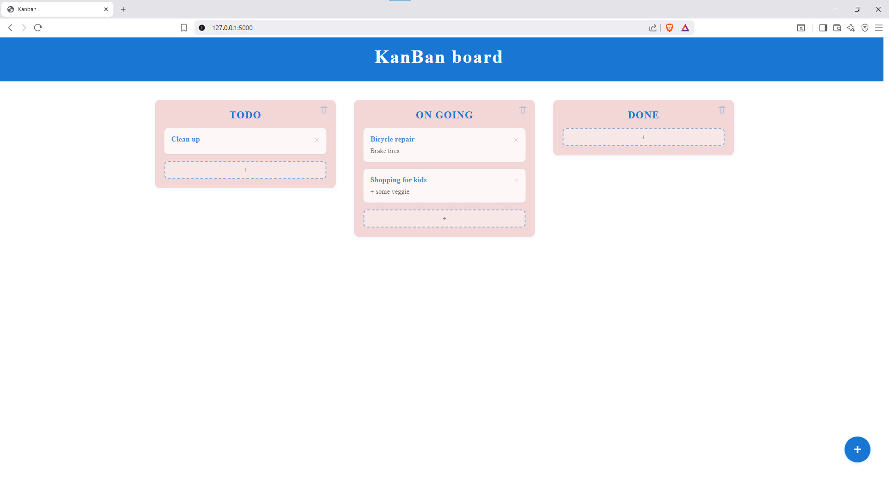

# pyKanban

A simple, self-hosted Kanban board written in pure Python (Flask) to help organize tasks, stages, and workflows. Designed to be lightweight, extensible, and easy to deploy.

## Why this project

- Built entirely in Python, lightweight, minimal dependencies  
- Designed for easy self-hosting  
- Intended to be simple to get started with, yet extensible so people can add features as needed

## Getting Started

1. Clone the repository  
    ~~~ 
    git clone COPIED_LINK
    ~~~

2. Run 

    ~~~ 
    python app.py
    ~~~

## Features

- One board with customizable stages (columns)
- Tasks with titles placed in stages
- Delete tasks and stages
- Data stored in SQLite
- Web interface (Flask + HTML/CSS/JS) to view and edit board
- Lightweight setup — minimal dependencies, pure Python

## Contribution

Contributions are welcome! If you find bugs or missing features, open an issue. If you’d like to implement something, feel free to submit a PR. Some guidelines:

- Keep code clean and well documented  
- Include tests for new functionality  
- Maintain backward compatibility where possible  

## Features to be implemented

Below are the types of improvements & enhancements planned / under consideration to make pyKanban even more usable and competitive:

**Data model & storage**

-  Swappable/adaptable database backend (SQLite initially, with support for heavier DBs like PostgreSQL)  
- Rich task fields: due date, description, priority, tags/labels  
- Multi-user support & permissions: different user roles, project/board membership, access control

**User experience / frontend**

- Drag-and-drop support for moving tasks between stages  
- Responsive design so it works well on mobile / tablets  
- Polished UI using a CSS framework (Bootstrap, Tailwind etc.) with better task cards etc.  
- Multiple views (board view, list view, calendar view), export to PDF/CSV

**API & Integrations**

- REST API (and possibly GraphQL) so other tools or automations can interact with the board  
- Webhooks for external integrations / notifications  
- Import/export: JSON, CSV, maybe compatibility with Trello or other Kanban formats

**Security & Deployment**

- User authentication & authorization  
- Basic security: HTTPS, secure headers, CSRF protection, input validation/sanitization  
- Testing: unit tests, integration tests; CI setup for automatically verifying code changes  
- Deployment guides: Docker, docker-compose, environment / configuration options

**Configurability & Extensibility**

- Flexible configuration: choose DB, host/port, authentication mode (OAuth, LDAP etc.)  
- Modular/plugin architecture to allow adding features without bloating core

**Scalability & Usage in Larger Environments**

- Multi-board / project support  
- Performance optimizations: pagination, caching where needed  
- Notifications: email, or push / browser notifications on task changes  

